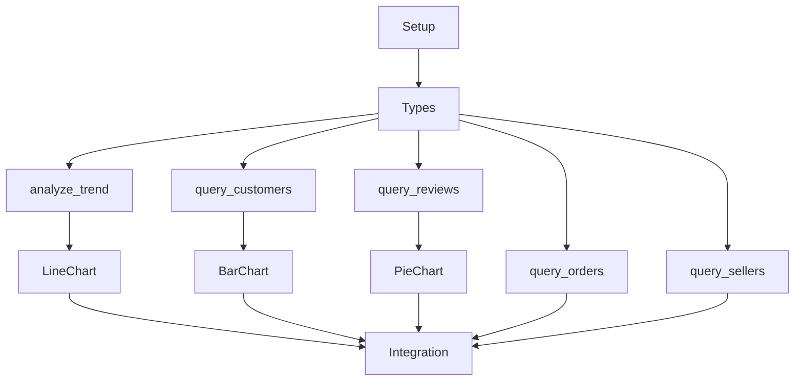

# Implementation Tasks: 功能扩展 - 多维度查询与可视化

**Branch**: `002-feature-expansion` | **Date**: 2026-02-05
**Plan**: [plan.md](./plan.md) | **Spec**: [spec.md](./spec.md)

## Phase 0: Setup

- [x] [T001] Setup: Create feature branch `002-feature-expansion` from main
- [x] [T002] Setup: Review existing MCP tools structure in `backend/src/mcp/tools/`
- [x] [T003] Setup: Review existing chart components in `frontend/src/components/Charts/`

## Phase 1: Type Extensions (Foundation)

- [x] [T010] [P1] Types: Extend `backend/src/types/` with query result types from data-model.md
- [x] [T011] [P1] Types: Extend `frontend/src/types/` with chart config types (LineConfig, BarConfig, PieConfig)
- [x] [T012] [P1] Types: Update ChartType union to include 'line' | 'bar' | 'pie'

## Phase 2: US1 - 订单数据查询与分析 (P1)

### Backend - query_orders Tool

- [x] [T020] [P1] [US1] Create `backend/src/mcp/tools/queryOrders.ts` with schema definition
- [x] [T021] [P1] [US1] Implement `status_distribution` analysis type (订单状态分布)
- [x] [T022] [P1] [US1] Implement `delivery_analysis` analysis type (配送时效分析)
- [x] [T023] [P1] [US1] Implement `delivery_by_region` analysis type (按地区配送分析)
- [x] [T024] [P1] [US1] Register query_orders tool in `backend/src/mcp/tools/index.ts`
- [x] [T025] [P1] [US1] Add integration tests for query_orders in `backend/tests/mcp/`

## Phase 3: US2 - 时间趋势分析 (P1)

### Backend - analyze_trend Tool

- [x] [T030] [P1] [US2] Create `backend/src/mcp/tools/analyzeTrend.ts` with schema definition
- [x] [T031] [P1] [US2] Implement daily/weekly/monthly/quarterly granularity aggregation
- [x] [T032] [P1] [US2] Implement YoY (同比) comparison calculation
- [x] [T033] [P1] [US2] Implement MoM (环比) comparison calculation
- [x] [T034] [P1] [US2] Register analyze_trend tool in `backend/src/mcp/tools/index.ts`
- [x] [T035] [P1] [US2] Add integration tests for analyze_trend in `backend/tests/mcp/`

### Frontend - LineChart Component

- [x] [T036] [P1] [US2] Create `frontend/src/components/Charts/LineChart.tsx` with ECharts
- [x] [T037] [P1] [US2] Implement multi-series support for comparison charts
- [x] [T038] [P1] [US2] Implement smooth line and area fill options
- [x] [T039] [P1] [US2] Update ChartRenderer.tsx to handle 'line' chart type

## Phase 4: US3 - 客户分析 (P2)

### Backend - query_customers Tool

- [x] [T040] [P2] [US3] Create `backend/src/mcp/tools/queryCustomers.ts` with schema definition
- [x] [T041] [P2] [US3] Implement `distribution` analysis type (客户地域分布)
- [x] [T042] [P2] [US3] Implement `repurchase` analysis type (复购分析)
- [x] [T043] [P2] [US3] Implement `value_segment` analysis type (客单价分析)
- [x] [T044] [P2] [US3] Register query_customers tool in `backend/src/mcp/tools/index.ts`
- [x] [T045] [P2] [US3] Add integration tests for query_customers in `backend/tests/mcp/`

### Frontend - BarChart Component

- [x] [T046] [P2] [US3] Create `frontend/src/components/Charts/BarChart.tsx` with ECharts
- [x] [T047] [P2] [US3] Implement horizontal and vertical orientation options
- [x] [T048] [P2] [US3] Implement data label display option
- [x] [T049] [P2] [US3] Update ChartRenderer.tsx to handle 'bar' chart type

## Phase 5: US4 - 评价分析 (P2)

### Backend - query_reviews Tool

- [x] [T050] [P2] [US4] Create `backend/src/mcp/tools/queryReviews.ts` with schema definition
- [x] [T051] [P2] [US4] Implement `score_distribution` analysis type (评分分布)
- [x] [T052] [P2] [US4] Implement `by_category` analysis type (按品类分析)
- [x] [T053] [P2] [US4] Implement `low_score_analysis` analysis type (差评分析)
- [x] [T054] [P2] [US4] Register query_reviews tool in `backend/src/mcp/tools/index.ts`
- [x] [T055] [P2] [US4] Add integration tests for query_reviews in `backend/tests/mcp/`

### Frontend - PieChart Component

- [x] [T056] [P2] [US4] Create `frontend/src/components/Charts/PieChart.tsx` with ECharts
- [x] [T057] [P2] [US4] Implement percentage display option
- [x] [T058] [P2] [US4] Implement hover tooltip with value and percentage
- [x] [T059] [P2] [US4] Update ChartRenderer.tsx to handle 'pie' chart type

## Phase 6: US5 - 卖家分析 (P3)

### Backend - query_sellers Tool

- [x] [T060] [P3] [US5] Create `backend/src/mcp/tools/querySellers.ts` with schema definition
- [x] [T061] [P3] [US5] Implement `ranking` analysis type (卖家排名)
- [x] [T062] [P3] [US5] Implement `distribution` analysis type (卖家地域分布)
- [x] [T063] [P3] [US5] Implement `performance` analysis type (卖家绩效)
- [x] [T064] [P3] [US5] Register query_sellers tool in `backend/src/mcp/tools/index.ts`
- [x] [T065] [P3] [US5] Add integration tests for query_sellers in `backend/tests/mcp/`

## Phase 7: Integration & Polish

- [x] [T070] Integration: Update generate_chart tool to support new chart types
- [x] [T071] Integration: Update agent system prompt with new tool descriptions
- [ ] [T072] Integration: End-to-end testing of all user stories
- [x] [T073] Polish: Add loading states for chart components
- [x] [T074] Polish: Add error handling for empty query results
- [ ] [T075] Polish: Verify chart tooltip interactions < 100ms

## Summary

| Phase | Tasks | Priority | User Story |
|-------|-------|----------|------------|
| Phase 0 | 3 | - | Setup |
| Phase 1 | 3 | P1 | Foundation |
| Phase 2 | 6 | P1 | US1 - 订单查询 |
| Phase 3 | 10 | P1 | US2 - 趋势分析 |
| Phase 4 | 10 | P2 | US3 - 客户分析 |
| Phase 5 | 10 | P2 | US4 - 评价分析 |
| Phase 6 | 6 | P3 | US5 - 卖家分析 |
| Phase 7 | 6 | - | Integration |
| **Total** | **54** | | |

## Dependencies

